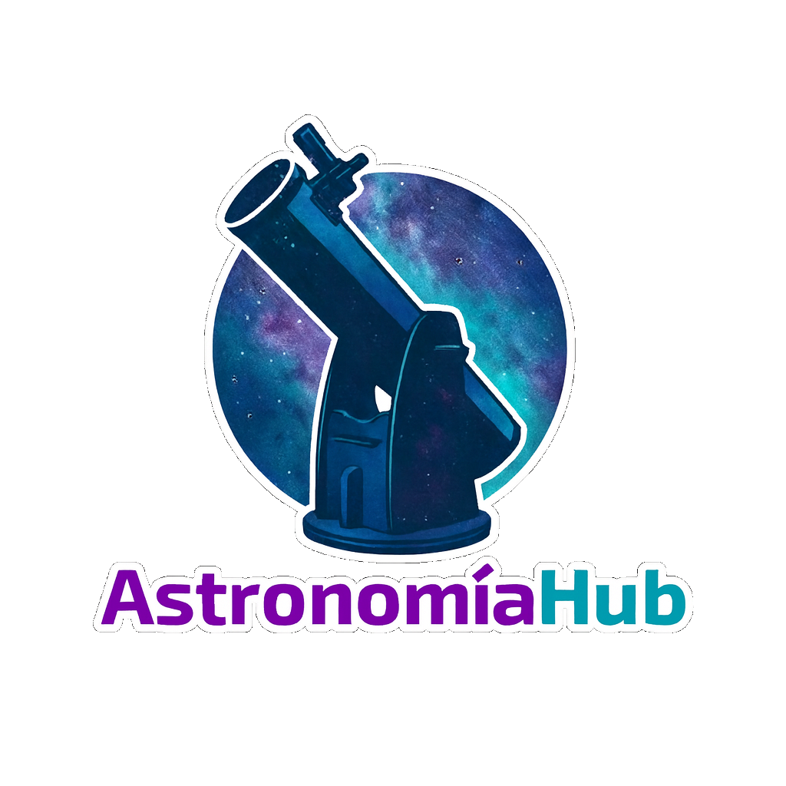

  

# Astronomiahub.io

Repositorio de observaciones astronómicas en formato JSON — **desarrollado por el equipo de AstronomiaHub**.

AstronomiaHub está construido sobre **UVLHub**, proporcionando una plataforma estructurada para gestionar, validar y publicar datos de observaciones astronómicas.

---

## Documentación oficial

La documentación completa y actualizada del proyecto está disponible en:

- https://docs.uvlhub.io/
- Instalación manual: https://docs.uvlhub.io/installation/manual_installation

---

##  Instalación manual

Seguir todos los pasos de https://docs.uvlhub.io/installation/manual_installation.

---

